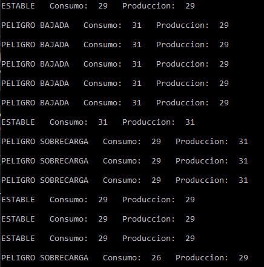

# ADA CITY SIMULATION
Little simulation of a city electricity production and consumption using concurrency in ADA.
 (For more information click [here](Practica_ADA.pdf))

## Usage

### Usage option list
 - Open and compile  **"ADA_CitySim_Proyect" folder** with GNAT and execute it.
 - Open **"ADA_CitySim_Proyect/obj" folder** and execute **main.exe**
